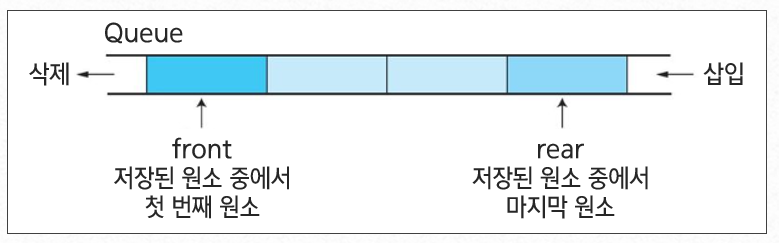
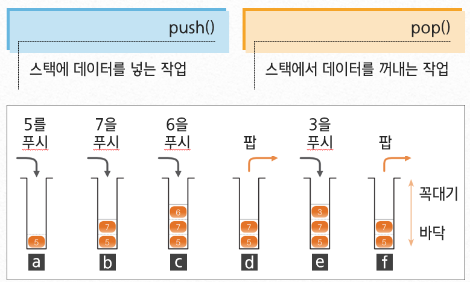

# 스택과 큐

---

## 1. 큐



- 영화관에서 가장 먼저 줄을 선 사람이 먼저 입장하는 것과 동일함
- FIFO(First-In, First-Out) 방식으로 스택과 꺼내는 순서가 반대임
- 큐는 한 쪽 끝은 프런트(front)로 정하여 삭제 연산만 수행함
- 다른 한 쪽 끝은 리어(rear)로 정하여 삽입 연산만 수행함

### 1-1. 큐의 연산
- Enqueue: 큐에 데이터를 넣는 작업
- Dequeue: 큐에서 데이터를 꺼내는 작업
- 사이트를 통해서 이해하기: [https://visualgo.net/en/list](https://visualgo.net/en/list)

### 큐가 많이 사용되는 곳
- 멀티 태스킹을 위한 프로세스 스케쥴링 방식을 구현하기 위해 많이 사용됨
> 프로세스 스케쥴링 방식을 함께 이해하는 것이 좋음

---

### 1-2. 자바를 통해 큐를 사용해보기

- `java.util` 패키지에서 Queue 관련 클래스를 제공함
    - Enqueue: `add()` 또는 `offer()` 메서드 사용
    - Dequeue: `remove()` 또는 `poll()` 메서드 사용
    - 자바에서는 스택은 클래스로 제공하지만, 큐는 인터페이스로 제공되므로 구현 클래스인 `LinkedList` 사용

```java
import java.util.LinkedList;
import java.util.Queue;

Queue<Integer> ArrayQueue = new LinkedList<Integer>(); // Integer 큐
Queue<String> StringQueue = new LinkedList<String>(); // String 큐

ArrayQueue.offer(1);
ArrayQueue.add(2);
ArrayQueue.add(3);

System.out.println(ArrayQueue); // [1, 2, 3]

ArrayQueue.remove(); // 첫 번째 값 제거
System.out.println(ArrayQueue); // [2, 3]

ArrayQueue.poll(); // 또 제거
System.out.println(ArrayQueue); // [3]
```

---

### 1-3. 큐 직접 구현해보기

- `ArrayList` 클래스를 활용한 큐 구현
- `enqueue()`와 `dequeue()` 구현
- 큐가 비었을 때 `dequeue()`는 `null` 반환
- 제네릭 사용

```java
import java.util.ArrayList;

public class DataQueue<D> {
    private ArrayList<D> queue = new ArrayList<D>();

    public void enqueue(D value) {
        queue.add(value);
    }

    public D dequeue() {
        if (queue.isEmpty()) {
            return null;
        }
        return queue.remove(0);
    }

    public static void main(String[] args) {
        DataQueue<Integer> dq = new DataQueue<Integer>();
        dq.enqueue(1);
        dq.enqueue(2);
        dq.enqueue(3);
        System.out.println(dq.dequeue()); // 1
        System.out.println(dq.dequeue()); // 2
        System.out.println(dq.dequeue()); // 3
    }
}
```

---

## 2. 스택



- 데이터를 일시적으로 쌓아 놓은 자료구조
- LIFO(Last-In, First-Out) 구조
- 가장 나중에 넣은 데이터를 가장 먼저 추출

### 스택의 주요 기능
- `push()`: 데이터 넣기
- `pop()`: 데이터 꺼내기

> Stack 시각화 사이트: [https://visualgo.net/en/list](https://visualgo.net/en/list)

---

### 2-1. 자바 Stack 클래스 사용

- `java.util.Stack` 클래스 사용
    - `push()`, `pop()` 메서드 제공

```java
import java.util.Stack;

Stack<Integer> intStk = new Stack<Integer>();
intStk.push(1);
intStk.push(2);
intStk.push(3);
intStk.push(4);

System.out.println(intStk.pop()); // 4
System.out.println(intStk.pop()); // 3
System.out.println(intStk.pop()); // 2
System.out.println(intStk.pop()); // 1
```

---

### 2-2. 스택 직접 구현해보기

- `ArrayList`를 활용
- `push()`, `pop()` 구현
- 비어 있을 때 `pop()`은 `null` 반환
- 제네릭 사용

```java
import java.util.ArrayList;

public class IntStack<S> {
    private ArrayList<S> stack = new ArrayList<S>();

    public void push(S data) {
        stack.add(data);
    }

    public S pop() {
        if (stack.isEmpty()) {
            return null;
        }
        return stack.remove(stack.size() - 1);
    }

    public static void main(String[] args) {
        IntStack<Integer> capacity = new IntStack<Integer>();
        capacity.push(1);
        capacity.push(2);
        capacity.push(3);
        capacity.push(4);

        System.out.println(capacity.pop()); // 4
        System.out.println(capacity.pop()); // 3
        System.out.println(capacity.pop()); // 2
        System.out.println(capacity.pop()); // 1
    }
}
```